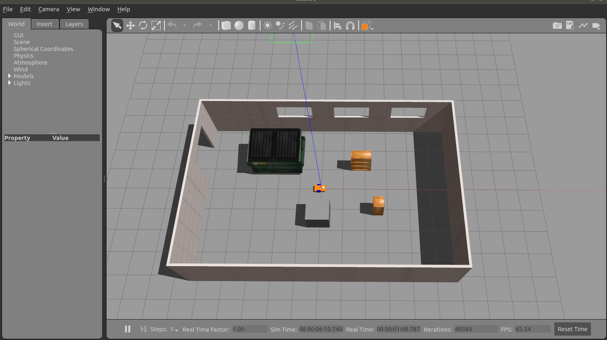
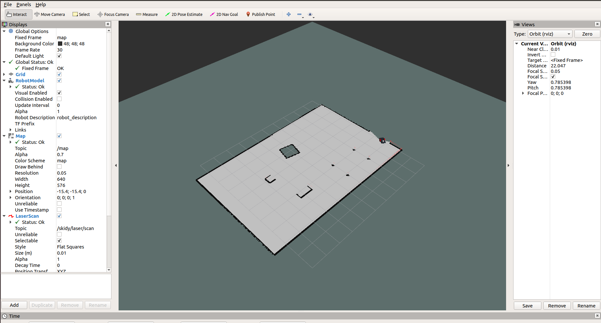
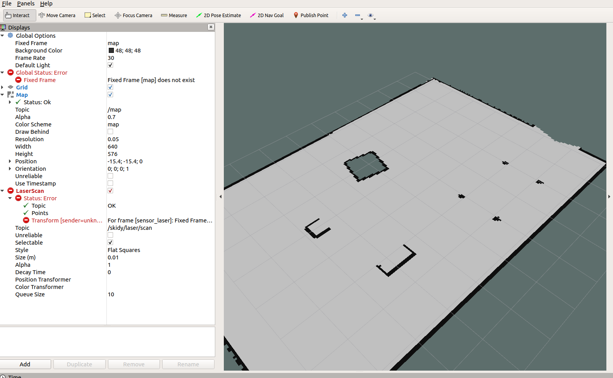
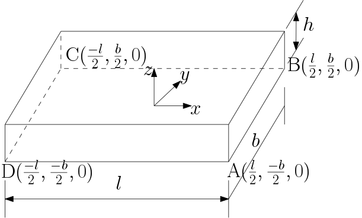

The tutorial is mostly from [theconstructsim](https://www.theconstructsim.com/ros-projects-exploring-ros-using-2-wheeled-robot-part-1/)
[Git repository](https://github.com/mattborghi/m2wr_description)

### Step by step instructions to ROS Navigation stack
Setup your catkin workspace
* `mkdir -p skidy_ws/src`
* `cd skidy_ws/src`
* `git clone https://github.com/ashBabu/skidy.git`
* `cd ../../`
* `catkin_make`
* `source devel/setup.bash`

`001_skidy_full.xacro` is the very basic urdf with links and joints for a mobile robot. To view the robot,
* `sudo apt-get install ros-melodic-urdf-tutorial`
* `rosrun xacro xacro --inorder -o f001_skidy_full.urdf 001_skidy_full.xacro` # to get the urdf
* `roslaunch urdf_tutorial display.launch model:='$(find ros_nav)/urdf/001_skidy_full.urdf'`
OR
* `roslaunch skidy_description skidy_in_rviz.launch`  to view the robot in Rviz.


### Creating a gazebo world
Official tutorial available [here](https://classic.gazebosim.org/tutorials?tut=build_world&ver=1.9).

Fire up a terminal and type the following
* `gazebo`  
this will launch the an `empty_world` in `gazebo`. Add primitives (sphere, cuboid etc.) or use the `Insert` tab to create your own world. Save your world under `skidy_description/gazebo_worlds/simple_world.world`.
* `roslaunch skidy_description 002_gazebo_world.launch` # to launch this

### Spawn skidy in gazebo
This requires adding the following to the `002_gazebo_world.launch` and is given in `003_skidy_in_gazebo.launch`

` <node name="skidy_gazebo_spawn" pkg="gazebo_ros" type="spawn_model" output="screen"
      args="-urdf -param robot_description -model skidy -x $(arg x) -y $(arg y) -z $(arg z)" />
`
* `roslaunch skidy_description 003_skidy_in_gazebo.launch`  to view the robot in gazebo.

This will look as shown below



### Add teleop_twist_keyboard
* ` sudo apt-get install ros-melodic-teleop-twist-keyboard`
* Add the following in the `urdf` or `skidy_gazebo.xacro`
```
<gazebo>
  <plugin filename="libgazebo_ros_diff_drive.so" name="differential_drive_controller">
    <alwaysOn>true</alwaysOn>
    <updateRate>20</updateRate>
    <leftJoint>joint_left_wheel</leftJoint>
    <rightJoint>joint_right_wheel</rightJoint>
    <wheelSeparation>0.4</wheelSeparation>
    <wheelDiameter>0.2</wheelDiameter>
    <torque>0.1</torque>
    <commandTopic>cmd_vel</commandTopic>
    <odometryTopic>odom</odometryTopic>
    <odometryFrame>odom</odometryFrame>
    <robotBaseFrame>link_chassis</robotBaseFrame>
  </plugin>
</gazebo>
```
After launching the `003_skidy_in_gazebo.launch`, in another terminal run the following
* `rosrun teleop_twist_keyboard teleop_twist_keyboard.py` to control the robot via keyboard

**Note:** Might need to do `source devel/setup.bash`


### Navigation with skidy
Create a new catkin package `skidy_navigation`
* `cd skidy_ws/src/skidy/`
* `catkin_create_pkg skidy_navigation std_msgs sensor_msgs geometry_msgs roscpp rospy actionlib`
* `cd skidy_navigation && mkdir scripts`
Add the Python files `read_laser.py, obstacle_avoidance and go_to_point.py`. The explanations are given in the [tutorial]("/construct_tutorial/001_ Exploring ROS Using a 2 Wheeled Robot _ The Construct.pdf") from chapter 4-6.

### Gmapping with skidy
* Set the parameters in `skidy_navigation/launch/skidy_gmapping.launch`. The important ones are
`scan_topic, base_frame, odom_frame`. The details for the rest can be found [here](http://wiki.ros.org/gmapping).
* `roslaunch skidy_navigation skidy_gmapping.launch`. This will launch both `Rviz` and `gazebo` as the following lines are already added to the launch file
```
<include file="$(find skidy_description)/launch/001_skidy_in_rviz.launch">
    <arg name="model" value="$(arg model)"/>
</include>
<include file="$(find skidy_description)/launch/003_skidy_in_gazebo.launch">
    <arg name="model" value="$(arg model)"/>
</include>
```
* `rosrun teleop_twist_keyboard teleop_twist_keyboard.py` # to control the robot using keyboard
* Add the following topics in `Rviz`
    * `LaserScan` with topic `skidy/laser/scan`
    * `RobotModel`
    * `Map` with topic `/map`
* Drive the robot using the keyboard to see the map building
* [Save the map](https://github.com/ashBabu/Utilities/wiki/ROS-Navigation#saving-the-map) using `rosrun map_server map_saver -f ~/skidy_ws/src/skidy/skidy_navigation/maps/map1`


This will look as shown below



### Loading a saved map file. [ROS map_server](http://wiki.ros.org/map_server)
* ```
<arg name="map_file"  default="$(find skidy_navigation)/maps/map1.yaml"/>
<node type="map_server" pkg="map_server" name="map_server" args="$(arg map_file)"/>
```
* The launch file used is given in `skidy_navigation/launch/skidy_motion_planning.launch`
* To load a map via command line `rosrun map_server map_server /path/to/map1.yaml`
* This will publish three additional topics, viz.,
  * `/map`
  * `/map_metadata`
  * `/map_updates`
* There is going to be a global frame error as shown below and can be solved only after configuring the navigation stack fully. (For the time being, it's ok)


### Adding controllers
* `catkin_create_pkg skidy_controllers controller_manager roscpp rospy std_msgs geometry_msgs actionlib`
* `catkin_make && source devel/setup.bash`
* Add a file `skidy_controllers/config/joints.yaml` and fill it up as shown
* In the `skidy_description/urdf` folder, add the following lines as shown in `urdf/skidy_gazebo.xacro`
```
<gazebo>
  <plugin name="gazebo_ros_control" filename="libgazebo_ros_control.so">
    <robotNamespace></robotNamespace>
  </plugin>
</gazebo>
```
* A new launch file incorporating these changes is shown in `skidy_controller.launch`. This has the following two lines responsible for spawning the joint state controller.
```
<rosparam command="load" file="$(find skidy_controllers)/config/joints.yaml" ns="skidy"/>
<node name="skidy_robot" pkg="controller_manager" type="spawner" respawn="false" output="screen" ns="skidy" args="joint_state_controller"/>
```
*  `roslaunch skidy_controllers skidy_controller_sim.launch`
* In the terminal window, a message would be displayed "started controller: joint_state_controller" on successful loading of the controller

#### A note on the robotNamespace
* Namespace is not actually required. But if it is given using the `ns=` tag, then the gazebo plugin should have the same namespace as well as shown (here `<robotNamespace>skidy</robotNamespace>`)
* `[ERROR] [1666783120.822605945, 310.512000000]: No p gain specified for pid.  Namespace: /skidy/gazebo_ros_control/pid_gains/left_wheel_hinge`. This is ok but if you want to rectify this, add a `skidy_controllers/config/gazebo_ros_control_params.yaml` with pid gains as given.

### Moving the robot in gazebo and Rviz by publishing to `cmd_vel` topic
* `roslaunch skidy_description 003_skidy_in_gazebo.launch`
* `roslaunch skidy_description 001_skidy_in_rviz.launch`
* Add robot model and change the fixed frame to `odom`
*
```
rostopi pub /cmd_vel geometry_msgs/Twist "linear:
  x: 0.0
  y: 0.0
  z: 0.0
angular:
  x: 0.0
  y: 0.0
  z: 1.0"
  ```
  (press the tab key twice to complete the cmd_vel msg)
* The above would tell the robot to rotate about `z` axis (`yaw`)

**Note** Since we are using a simulated robot in `gazebo`, things like `/odom, /cmd_vel` are already calculated and are published/subscribed by gazebo plugins. A bit more detailed explanation is available [here](https://subscription.packtpub.com/book/hardware-and-creative/9781783987580/8/ch08lvl1sec62/creating-a-base-controller). For a real physical robot, the navigation stack has to be set up as descripbed [here](http://wiki.ros.org/navigation/Tutorials/RobotSetup).

### Footprint of skidy


~

where `l = 0.5, b = 0.3, z = 0.07`

### Configuring parameters for move_base
* Create the following configuration files under `skidy_navigation/config` and fill it with details as provided in [here](http://wiki.ros.org/navigation/Tutorials/RobotSetup) at section 2.3.       
  * `skidy_costmap_commom_params.yaml`
  * `skidy_global_costmap_params.yaml`
  * `skidy_global_local_params.yaml`
  * `skidy_base_local_planner_params.yaml`
* `roslaunch skidy_navigation skidy_motion_planning.launch` This launches `Rviz, gazebo, map_server, amcl` and `move_base`.
* Using `2D Nav goal` in `Rviz`, we can send navigation goals to the skidy. (As on 4-Nov-2022, the tuning is not proper and hence the robot goes to the goal occasionally)

**Notes:** `gazebo`'s differential_drive_controller plugin subscribes to `\cmd_vel` topic (a [Twist()](http://docs.ros.org/en/noetic/api/geometry_msgs/html/msg/Twist.html) msg or `rosmsg show geometry_msgs/Twist`) and find the change in position of robot from a fixed frame (usually `odom` or `map`). This frame can be set in `<odometryFrame>odom</odometryFrame>` in the `skidy_description/urdf/skidy_gazebo.xacro`. A litte more detailed explanation available [here](https://kiranpalla.com/autonomous-navigation-ros-differential-drive-robot-simulation/simple-navigation-with-differential-drive-plugin/). 
